# DigisynLink3 GUI Instruction manual

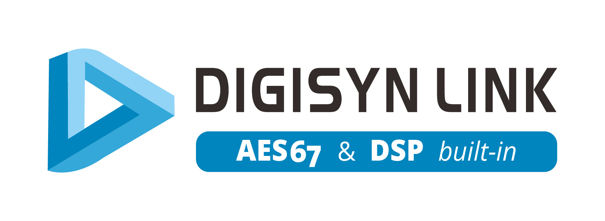

__The [Digisyn Link][digisyn-link] is a comprehensive platform that covers all DSP functions of the entire audio chain, from source input and DSP processing to speaker output.__ 

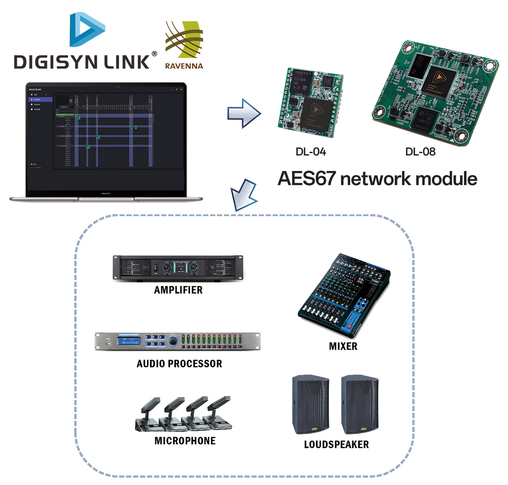

The system is capable of routing and distributing all audio signals, performing DSP processing, and controlling and monitoring all devices, while maintaining lossless audio signal quality and ultra-low latency in accordance with the AES67 standard.

Any audio device can equipped with __[DL-04 series network modules][dl-04]__ or __[DL-08 series network modules][dl-08]__.

 __[Digisyn Link3 GUI Controller][gui]__  performs audio routing, DSP processing and network monitoring on DL module embedded devices and __[Digisyn VSC (AES67 Virtual Sound Card)][vsc]__.

The __[Digisyn Link][digisyn-link]__ system is optimized for large, demanding audio systems and is an ideal choice for any location that requires a powerful audio processing system and full compliance with broadcasting standards.

## 1. Software installation
+  Double-click the software installation package to install. You can choose the installation language. Simplified Chinese/English is supported. After selection, click <kbd>OK</kbd>.

+  Choose whether you need a shortcut. After selection, click <kbd>Next</kbd>.

+  If you need to reselect, you can click the previous step to return. If not, click <kbd>Install</kbd>.

+  Wait for about 5 seconds for the installation to be completed.

+  Click <kbd>Finish</kbd> to enter the software.

## 2. Language switching

At the lower left corner of the software, click the language button to switch languages. Simplified Chinese/English is supported：

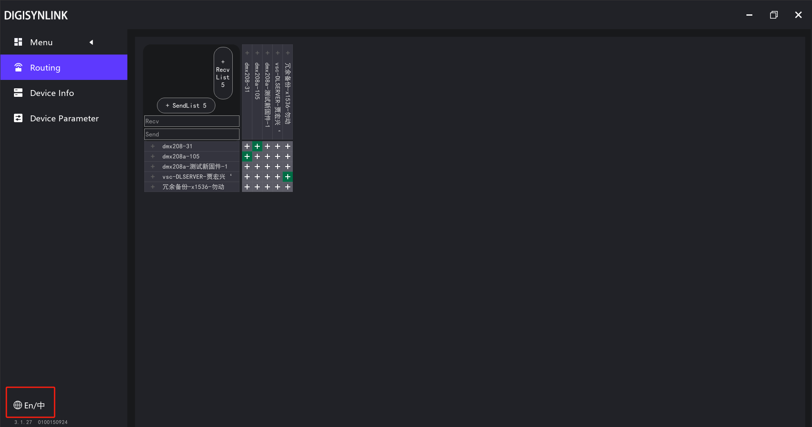

## 3. Discover device

The software discovers and controls devices through the local area network. When opening the software, it is necessary to specify which network card of the computer is used (___different network cards may correspond to different local area networks___). If there is only one network card, the software will select it by default. If there are multiple network cards, it needs to be manually specified：

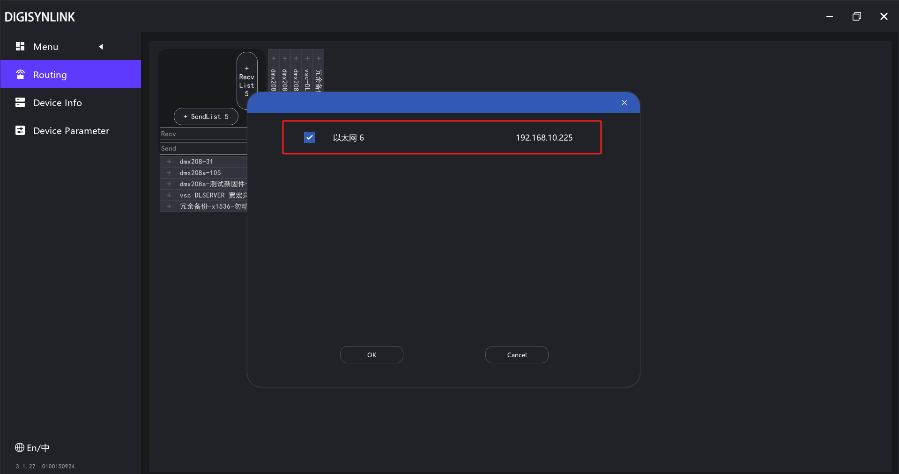

If the network cable of the computer is plugged or unplugged or the network is switched, the corresponding network card needs to be reselected. Click the menu and select it in the drop-down window<kbd>Set network card</kbd>：

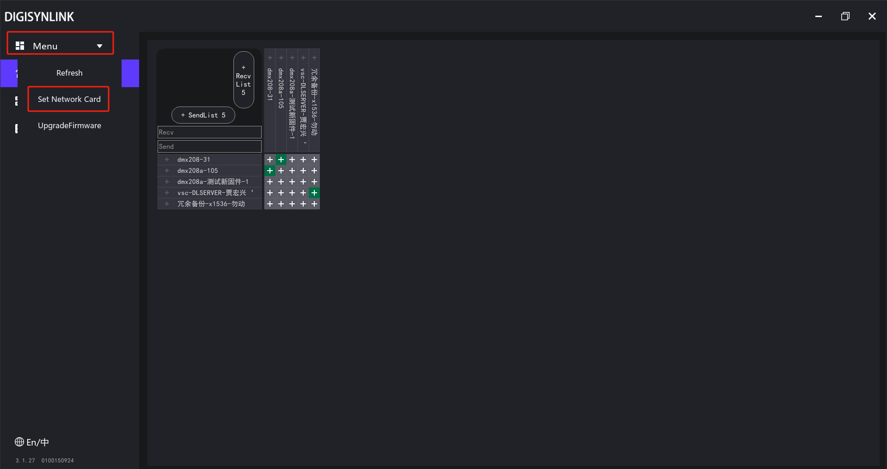

After selecting the network card, the software will automatically discover the devices in the corresponding local area network. Wait for about ___5 seconds___ to discover the devices：

You can also refresh the device list by <kbd>Menu - Refresh</kbd>：

## 4. View device information and parameters

On the left side of the software, click <kbd>Device Information</kbd> column，You can view the basic information of the device：

+ <kbd>Device name</kbd>:_The name displayed by the device on the interface. You can be modified in the<kbd>Device configuration</kbd>.Double-click the name of the device, click Device Configuration, find the device name in the device information column, and then click to modify it：

+ <kbd>Device type</kbd>:Used to distinguish device types. Different types correspond to different products, functions, and numbers of channels and cannot be modified.

+ <kbd>Device ID</kbd>：Used to uniquely identify a device. It will not change, will not be repeated, and cannot be modified.

+ <kbd>Synchronization status</kbd>: Judge whether it has been synchronized. This page is refreshed every 5-10 seconds. After the device is connected to the network, it will automatically synchronize with the main device. The synchronization is completed in about one minute.

+ <kbd>PPM</kbd>:Description parameter for clock alignment of master and slave devices. Generally, it is within ±30.

+ <kbd>Master/Slave</kbd>:Whether it is a master device or a slave device. There is only one master device in a local area network. If there are other non-DigisynLink devices using PTP clocks, they will also participate in the selection of master and slave devices together. That is, if there is a non-DigisynLink device in the same local area network and its clock priority is higher, all DigisynLink devices on the software may act as slaves.

+ <kbd>Clock priority</kbd>: A parameter used to select master and slave devices. The range is 0-255. The smaller the value, the higher the priority. The default is 128. The system will automatically select the device with the highest priority (smallest value) in the network as the master device. You can manually specify a certain device to be the master (increase the priority). ___Virtual sound cards ([VSC][vsc]) and some special devices cannot be masters. The clock priority cannot be modified and is displayed as NA.___

+ <kbd>Version</kbd>: Displays the firmware version number of the device. The version of the virtual sound card is viewed on the virtual sound card software. This page shows NA.

On the left side of the software, click the <kbd>device parameter</kbd>column，You can view the parameter information of the device：
+ <kbd>Device name</kbd>：Same as above. Device type: same as above. Device ID: same as above.

+ <kbd>Sampling rate</kbd>：The audio sampling rate of the device. If audio is transmitted between different devices, make sure the sampling rates are the same. It can be modified in "Device Configuration".
+ <kbd>Packet time</kbd>：A setting parameter for network audio data packets. It can be modified in "Device Configuration".
+ <kbd>Running time</kbd>：The continuous running time of the device since this startup. It can be sorted from largest to smallest or from smallest to largest.
+ <kbd>Network latency</kbd>：A setting parameter for network audio transmission latency. It can be modified in "Device Configuration".
+ <kbd>Temperature</kbd>：The temperature of the core part of the device. During normal use, control the temperature below 70°C and do not exceed 80°C.
+ <kbd>Clock priority</kbd>：It is a parameter used to select master and slave devices. The range is 0 to 255. The smaller the value, the higher the priority. The default is 128. The system will automatically select the device with the highest priority (smallest value) in the network as the master device. You can manually specify a certain device to be the master (increase the priority). Virtual sound cards and some special devices cannot be masters and cannot modify the clock priority, so "NA" is displayed.
+ <kbd>Version</kbd>：It shows the firmware version number of the device. The version of the virtual sound card can be viewed on the virtual sound card software. This page shows "NA".

## 5. Clock priority setting
It can be modified in the "Device Information" column. Click <kbd>Device Information</kbd>to enter. Select the required device in the clock priority column for modification：

## 6. PTP DSCP Priority setting
It can be modified on the <kbd>Device Details - Others</kbd> page. After modification, click <kbd>Restart</kbd> to complete：

This parameter, in switches that support QoS, will affect the priority of the audio transmission stream. The range is 0 to 63, and the default is 46. The larger the value, the higher the priority and the higher the transmission stability.

## 7. IP Address setting
It can be modified on the <kbd>Device Details - Device Configuration</kbd> page of device Config. Two methods are supported: automatic acquisition and manual setting：

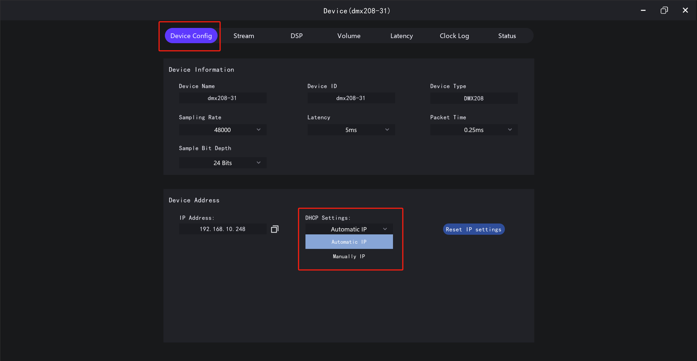

+ If it is automatic acquisition, make sure that the IP address of the computer is also obtained automatically, or manually set the same network segment.
+ If it is manual setting, make sure that the IP of the computer is also manually set and set in the same network segment.
If the IP addresses of the computer or device are not in the same network segment, it will cause the device to be unable to be viewed/controlled normally (except when the switch is set to support cross-network segments).
## 8.Device details

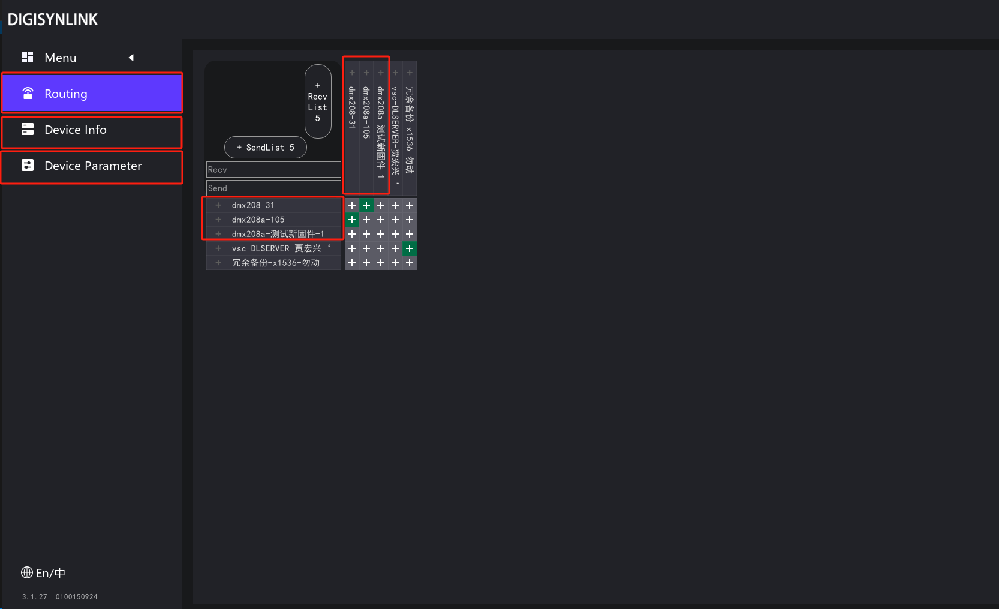

On any page of  <kbd>Device Routing</kbd>、<kbd>Device Information</kbd>、<kbd>Device Parameters</kbd> ，double-clicking the device name or device row will pop up the<kbd>Device Details</kbd> page：

### 8.1 Device configuration

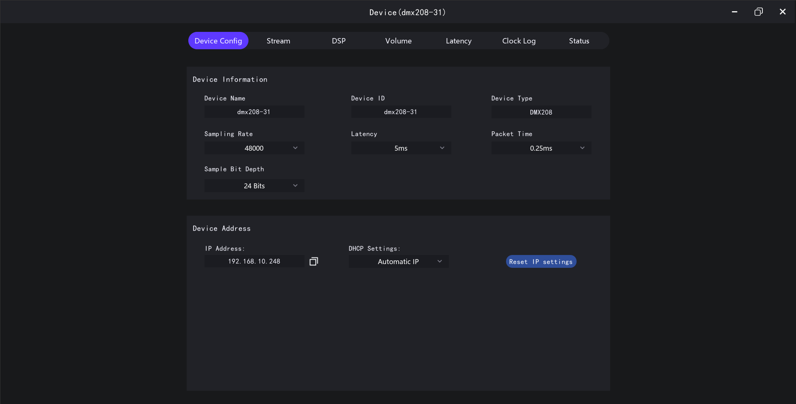

+ <kbd>Device name</kbd>：The name of the device can be modified. It cannot exceed 32 characters. By default, it is the same as the device ID.

+ <kbd>Device ID</kbd>：The unique ID for identifying the device cannot be modified.
+ <kbd>Device type</kbd>：Used to distinguish the device type and cannot be modified.
+ <kbd>sampling rate</kbd>：Audio sampling rate. It is distinguished according to the device type. For some types, it can be modified.

+ <kbd>network latency</kbd>：Network latency parameter. The smaller the value, the smaller the latency. However, it requires a better sending device and network environment. If you need the smallest possible latency, it can be set to 1ms (requiring a sufficiently good sending device and network environment). If you need better compatibility with the sending device and network environment, it can be set to 10ms. The default is 5ms. If using a virtual sound card as the sending device, since the virtual sound card depends on the computer system, it cannot be set to 1ms. You can set it to 5ms or 10ms according to the actual situation. (If there is discontinuity or packet loss at 5ms, it can be changed to 10ms).

+ <kbd>Packet time</kbd>: A parameter for network data packets. The network latency must be not less than 4 times the packet time. That is, if the packet time is set to 0.25ms, the network latency can be set to a minimum of 1ms. If the packet time is set to 1ms, the network latency can be set to a minimum of 5ms and cannot be set to 1ms. If you want to set the network latency to 1ms, you must first change the packet time to 0.25ms.

+ <kbd>IP address</kbd>：Display the IP address of the current device.

+ <kbd>DHCP settings</kbd>：The acquisition method of the device IP address supports automatic acquisition and manual setting. When setting manually, first click <kbd>Modify</kbd>, then enter the specified value in the corresponding input box, and click <kbd>Submit</kbd>. When setting manually, it is necessary to ensure that the IP address, subnet mask, DNS server address, gateway, etc. are correct. Otherwise, it may not be possible to view/obtain device information normally.

+ <kbd>Reset IP address</kbd>：If the IP address is in manual setting mode and incorrect parameters are set, resulting in the software being unable to view/obtain device information, the IP can be reset to change the device to automatic acquisition mode. 

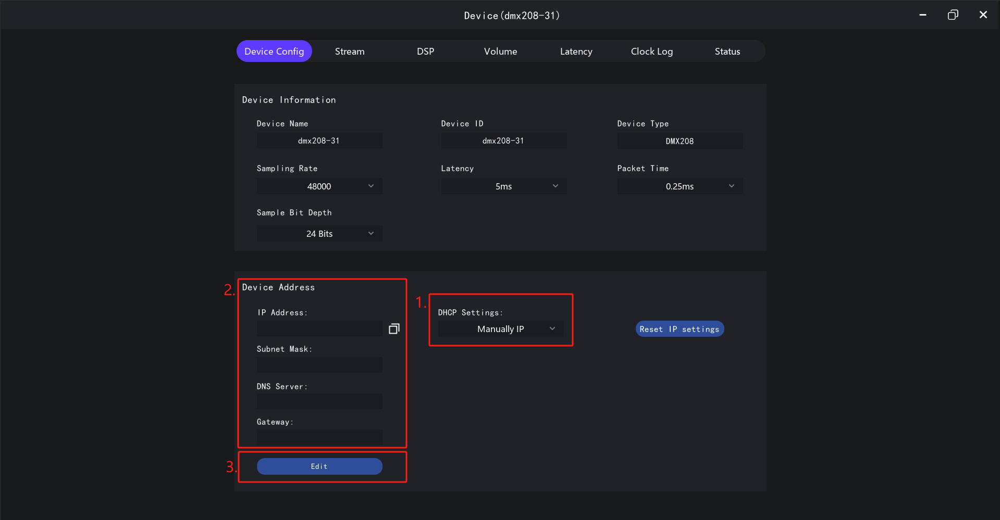

### 8.2 transport stream

<kbd>Unicast stream</kbd>：This page displays the unicast receiving, sending routing, stream records and status of the device. (This data is updated every time the device details are opened.)

+ rxChArr(rtpChId)：The routing records of the receiving channels. The first number represents the channel ID (0 represents channel 1). The content in parentheses represents the subscript of rtpChArr, corresponding to the index of the rtcChArr(srcDevId,srcChId) list. -1 means there is no routing. For example, 0(-1) means that there is no routing record for receiving channel 1. 4(4) means that there is a routing record for receiving channel 5, and the routing record corresponds to the record 4(dmx208-5a7b066, 0) with an index of 4 in the rtcChArr(srcDevId,srcChId) list.The routing records are generated and deleted when checking the network audio routing on the routing interface. Generally, there is no need for manual maintenance. If the other device associated with the routing is offline and the routing record needs to be deleted, you can double-click the corresponding channel in the rxChArr(rtpChId) column to delete it.

+ rtpChArr(srcDevId, srcChId)：srcDevId corresponds to the ID of the sending device. srcChId corresponds to the channel index of the sending device. 0 represents channel 1.

+ ucastArrRx(active, srcIp)：It represents the array of unicast received data streams. "active" indicates whether it is active. 0 means inactive, and 1 means active. Only in the active state can audio streams be transmitted. "srcIp" represents the IP address of the sending device.

+ mcastArrRx(active, srcIp): Represents the array of multicast received data streams. "active" indicates whether it is active. 0 means inactive, and 1 means active. Only in the active state can audio streams be transmitted. "srcIp" represents the IP address of the sending device.

+ ucastArrTx(dstIp)：Represents the array of sending channels that have currently established connections (the array index has nothing to do with the channel). "dstIp" represents the IP address of the receiving device.

+ mcastArrTx(dstIp, name)：The array of multicast sending streams that have been created. "dstIp" represents the multicast stream address. "name" represents the multicast stream name.

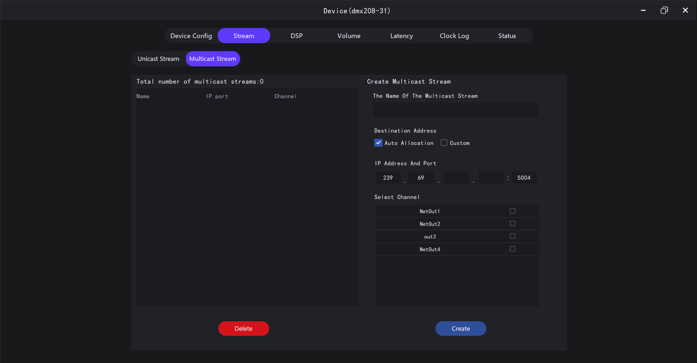

<kbd>multicast stream</kbd>：This page can create, view, and delete multicast streams.

<kbd>Multicast stream name</kbd>：The name displayed after creation. It should not exceed 32 characters.

<kbd>destination address</kbd>：The address of the multicast stream. If there are no special requirements, automatic allocation can be selected. You can also customize the address.

<kbd>Select channel</kbd>：The sending channels that the multicast stream needs to include. The selected channels can be sent out using the multicast stream.

<kbd>delete</kbd>：You can delete the created multicast stream.

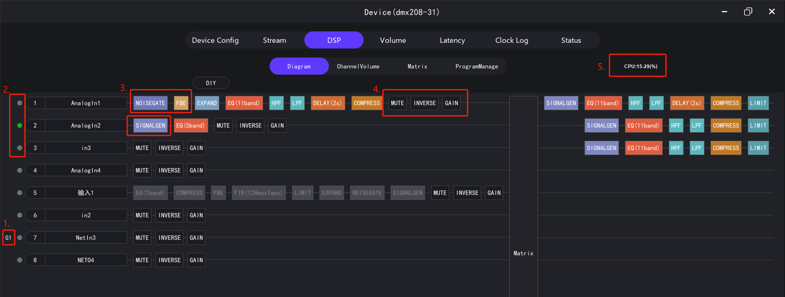

<kbd>flow chart</kbd>：Here you can view the functions of DSP input and output channels.

1. The area represents the groups that the channels join. After the channels join the groups, they will be displayed here.
2. The area represents the channel level indication. Green indicates there is a level, and gray indicates there is no level.
3. The area represents the DSP function of the channel. Bright color indicates that the function is enabled (non-pass-through), and gray indicates that the function is not enabled (pass-through). Double-clicking the corresponding function box will pop up the detailed parameter setting page. Multiple detailed parameter setting pages can be opened at the same time.
The DSP functions of different channels may be different.

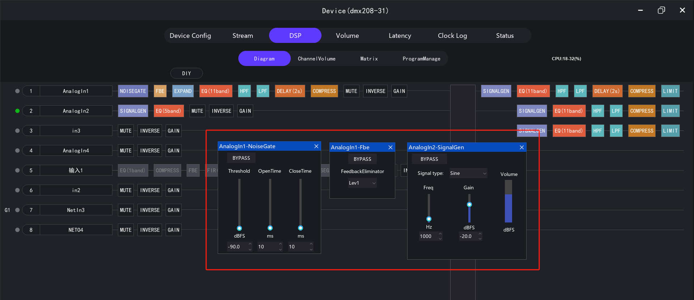

4. The area represents the mute, reverse, and gain functions. Mute and reverse can be toggled by clicking. Double-click gain to open the adjustment window.
5. The area represents the current CPU usage. Enabling DSP functions (non-pass-through) will increase CPU usage, and disabling DSP functions (pass-through) will reduce CPU usage. CPU usage should not exceed 85%.
Right-click on the channel number to pop up the function menu. You can copy and paste channel parameters and add/cancel channel grouping.
Right-click on the DSP function block to pop up the function menu. You can copy and paste function parameters.
### 8.3 Channel volume and grouping：

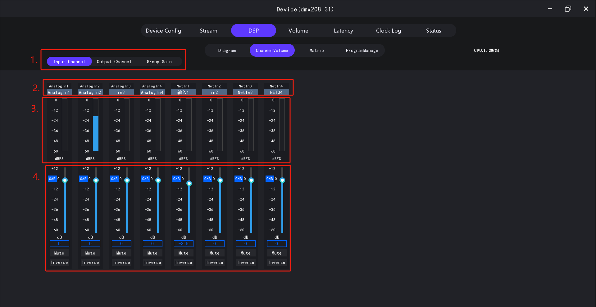

1. The area represents input, output channels, and group switching.
2. The area represents the channel name. The gray part cannot be modified. It indicates whether it is an analog or network channel and the channel subscript. The black name can be modified by yourself. The length should not exceed 32 characters.
3. The area refreshes the level of the channel in real time.
4. The area represents channel gain, mute, and reverse.

1. The area represents the group name.
2. The area indicates which channels are under the corresponding group. It is divided into two parts. The upper part is the input/output channel and subscript, and the lower part is the channel name.

<kbd>Matrix control</kbd>：

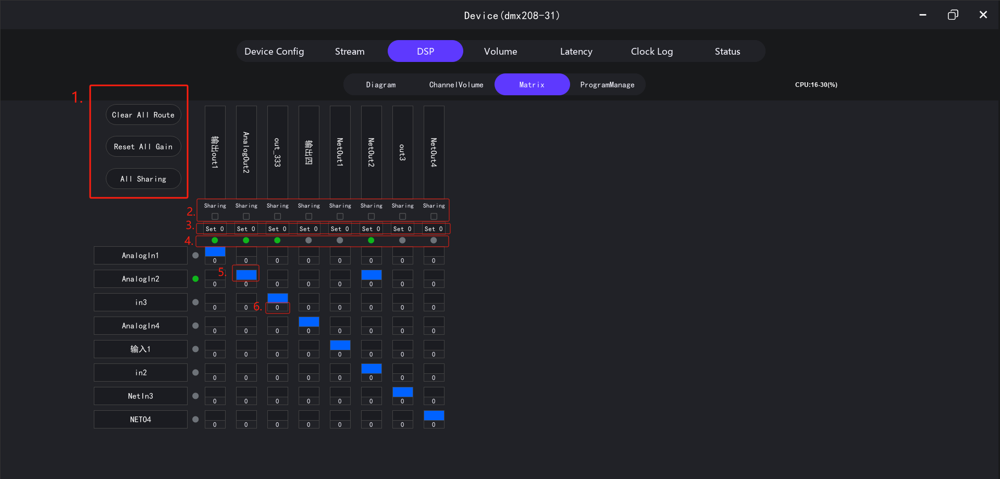

<kbd>Program management</kbd>：

1. The area represents the system's default program. This program cannot be modified, deleted, saved, etc.
2. The area represents the programs saved by yourself. 1-20 are customizations, supporting 20 custom programs.
3. The area is the program manually loaded last time. If after loading, the parameters are manually adjusted, then the parameters will be saved in the state before shutdown and will not be automatically saved to the corresponding program. That is, if program A is manually loaded and then the parameters are modified, then after shutdown and restart, the modified parameters will still be effective. However, if program A is reloaded, the modified parameters will be lost. If you want to save the modified parameters to program A, you need to manually click "Save Program" to save them.
4. The area is the management function area.
   +  Save Program: Select the corresponding serial number in the list to save the current machine parameters to the program.
   + Load Program: Select the corresponding program in the list to load the program parameters into the machine.
   + Delete Program: Select the corresponding program in the list to delete the program from the machine.
   + Export to PC: Select the corresponding program in the list to export the program to a computer file.
Import from PC: Select the corresponding serial number in the list to import a computer file into the machine.

### 8.4 <kbd>Channel volume</kbd>
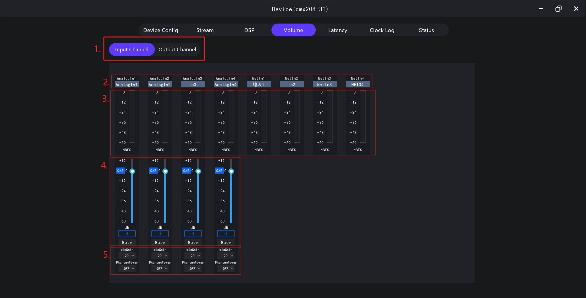

1. The area represents the switching between input and output channels.
2. The area represents the channel name. The gray part cannot be modified and distinguishes between analog input, network input and channel number. The black part can be modified and the length should not exceed 32 characters.
3. The area represents the channel level.
4. The area represents channel gain and mute. Only analog channels have this function, while network channels do not.
5. The area has functions for some specific models, but general models do not.
### 8.5 <kbd>Delay statistics</kbd>
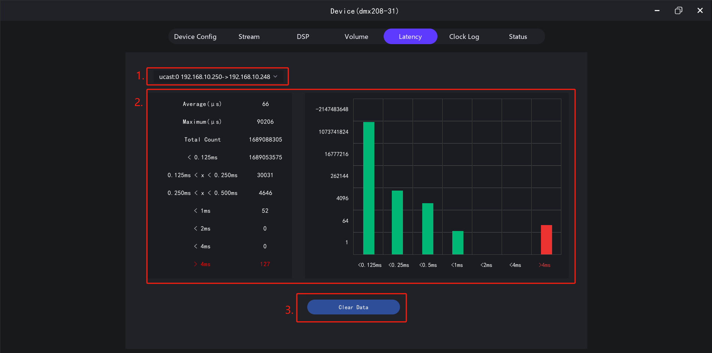

1. The area represents the data stream. If data is received from multiple devices or the number of receiving channels exceeds the number of channels that a stream can accommodate, there will be multiple data streams at this time. Switching can view the statistical data of different streams.
2. The area represents statistical data. Before the machine is powered on and synchronized, the data will appear as a red bar. This is normal. At the beginning of power-on, the clock is not synchronized. After the clock is synchronized, the red color will no longer increase.
3. The area can clear the data and perform statistics again. Generally, if an occasional individual red bar appears, it is due to fluctuations in the network environment and does not affect sound transmission. If there is a continuous increase in red data at intervals, it indicates abnormal network or device transmission, and troubleshooting is required.
### 8.6 <kbd>Clock log</kbd>

When the clock log page is opened, it will monitor the log information of the device. This information is used for device debugging and can be used to check whether the clock synchronization is normal.
### 8.7 <kbd>Others</kbd>

This page displays the version information, device code, temperature, running time, etc. of the device.
This page can set the Ptp DSCP priority.
This page can restart the device (some models support this function. For some devices, a full power-off restart is required).
## 9. Device network routing settings
The device routing configuration is all configured for network channels. The channels in the following figure are all network input and output channels.

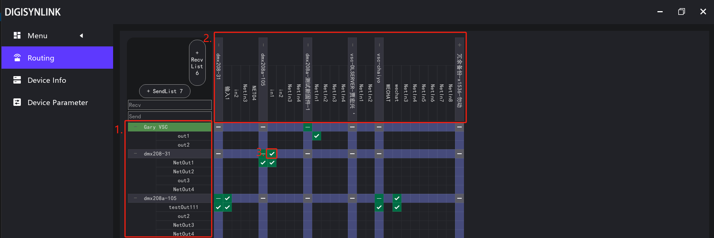

1. The area is the sending device list. After expanding it, you can see the network sending channels of the device.
2. The area is the receiving device list. After expanding it, you can see the network receiving channels of the device.
3. The area is whether to route. The selected state means that the network sending channel signal of the device corresponding to area 1 is sent to the network receiving channel of the device corresponding to area 2.
## 10. <kbd>Device firmware upgrade</kbd>

Click<kbd>Menu - Firmware Upgrade</kbd>，and the firmware upgrade interface will pop up：

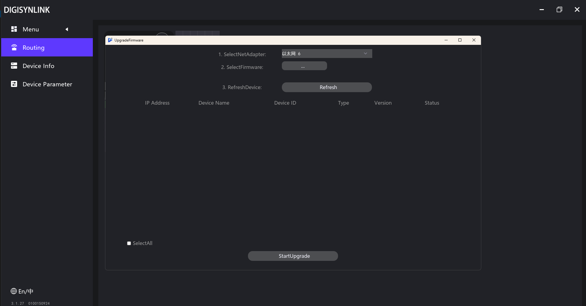

+ <kbd>Select network card</kbd>：For a computer with only one network card, the default selection is fine. For a computer with multiple network cards, select the network card corresponding to the device local area network. If they are not in the same local area network, the device cannot be found.

+ <kbd>Select firmware</kbd>：Select the firmware upgrade package used for machine upgrade. Do not unzip the upgrade package. Just select it directly. The upgrade package model must be corresponding, otherwise the upgrade will fail. The version of the device and the upgrade package must be corresponding, otherwise the upgrade will fail and the machine will be abnormal.
For devices with version 3.x.x, the latest firmware version can be directly upgraded.
For devices with version 2.x.x, a specific firmware upgrade package needs to be used to upgrade to 3.0.7 first, and then upgrade to the latest version.
Click "Refresh Device", and all devices in the network will be displayed. If there are any that do not appear, click "Refresh" twice more.
Select the corresponding device. Be sure to check the type and distinguish the device to be upgraded through IP address, device name, and device ID. Click "Start Upgrade" and observe the "Status" column until the upgrade is completed.
## 11. Advanced functions
### 11.1 Custom DSP function
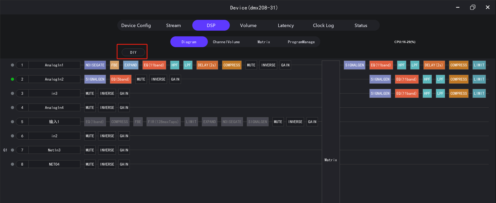

For device types that support the DSP function, enter the "Audio Processing" page. Press and hold Ctrl+8 at the same time, and enter the control code 6689. A "Customize" button will be displayed in the upper left corner. Click "Customize" to enter the custom DSP page.

1. The area is for devices that support automatic mixing and echo cancellation. Functions can be added here.
2. The area is for canceling customizations and saving custom functions.
3. The area is for CPU usage assessment. The custom DSP function cannot exceed the maximum CPU occupancy rate.
4. The area is the button for adding DSP functions. Clicking it can freely add function blocks.
For equalization, high pass, and low pass, only one can be set for each channel.
For the delay function, all channels share a delay upper limit.
5. In the area, for the corresponding DSP function, right-click to delete the function block.
Right-click on the channel ID to copy the function block of the entire channel and paste it to other channels.
### 11.2 Modify the number of channels of the module

For device types that support modifying channels, on the <kbd>Device Information - Others</kbd>page:
+  press and hold __"Ctrl+8"__ at the same time and enter the control code __'6688'__. The channel and parameter configuration function page will be displayed.
+ The area is the function operation button. <kbd>Refresh Configuration</kbd> can refresh the current configuration data of the device. 

+ <kbd>Modify Configuration</kbd> can submit the modified content to the device. After submission, the device needs to be restarted for the changes to take effect.
If the device supports the DSP function, after modifying the number of input channels and output channels, the default DSP configuration needs to be modified (refer to 11.3). If the device does not support the DSP function, there is no need to configure the DSP.
### 11.3 Modifying the default DSP configuration

For devices with DSP functions, after modifying the number of channels, the DSP configuration file needs to be updated. Otherwise, the number of channels does not match the original configuration file, and the DSP function cannot be loaded normally.

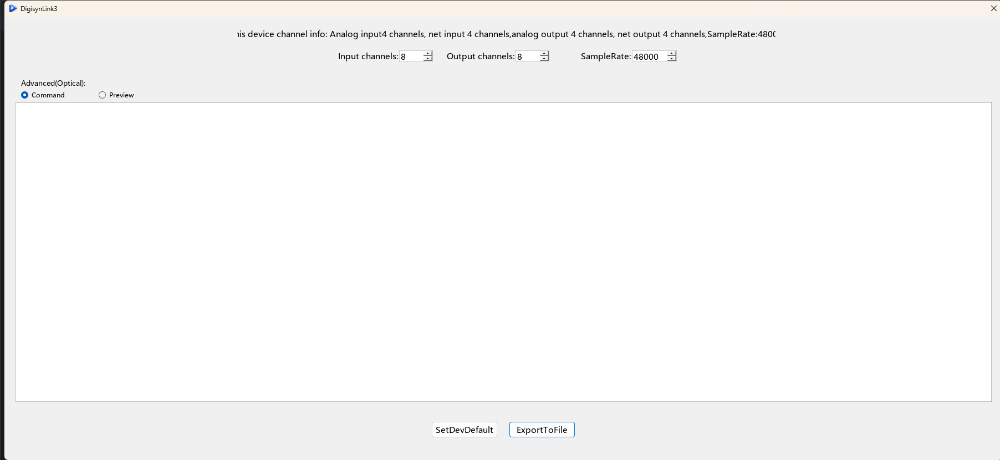

After modifying the number of channels in 11.2, restart the device to make the number of channels take effect. Then enter <kbd>Advanced Configuration</kbd>. As shown in the figure.

After confirming the number of input and output channels and the sampling rate, click <kbd>Set as Default</kbd> (after restarting due to modifying the channels, do not click the <kbd>Audio Processing</kbd> page, otherwise the advanced configuration modification will fail). This can reset the DSP configuration. After resetting the DSP configuration, the machine needs to be restarted for the changes to take effect, thus completing the modification.

## 12. Troubleshooting
### 12.1 When the software starts, it prompts that the xxx.dll library is missing.
The prompt for the lack of a dll library indicates that the computer system lacks Microsoft runtime libraries. Downloading <kbd>Microsoft VC++ runtime library collection</kbd>and installing it can solve the problem.
### 12.2 The software cannot detect the device
Check whether the network card selection is normal. Be sure to select the network card in the same local area network as the device. Check whether the firewall has blocked the software from connecting to the Internet.
Through the firmware upgrade program, check whether the device can be searched. If the firmware upgrade program can search but the software cannot detect it, first check the above two items.
Check whether the network port light of the device is flashing. If the network port light is not flashing, first check the hardware.
### 12.3 The software can detect the device but cannot control it
Check whether the network card selection is correct.
Check whether the IP address of the computer and the IP address of the device are in the same local area network. Check whether the computer has set a fixed IP, resulting in the computer and the device not being in the same local area network.
Check whether the network is normal. Check "Device Parameters" to see if the running time can be obtained. If the running time cannot be obtained, check the computer network and switch status (you can check for packet loss through the ping command). Sometimes, when a laptop uses a USB network port adapter, there may be problems with poor network connectivity.
### 12.4 Firmware upgrade fails

Check whether the network card selection is correct. Be sure to select the network card in the same local area network as the device. Check whether the firewall has blocked the software. Check whether the firmware type is consistent with the device type. Check whether the firmware version is correct.
If the firewall is enabled, the following programs need to be set to allow network access:
+ ___DigisynLink3.exe___ 
+ ___DigisynLink3Upgrade.exe___
+ ___gohttpserver.exe___

## About this repository

1.  This repository is for storing the __Digisyn Link3 GUI__ software package and the user manual. To download Digisyn Link3 GUI, please click __"Releases"__ on the right.
2.  For more information about the Digisyn Link, please visit **[www.digisynthetic.com][digisynthetic]**.

[digisyn-link]: https://www.digisynthetic.com/digisynlink

[dl-04]: https://www.digisynthetic.com/
[dl-08]: https://www.digisynthetic.com/
[digisynthetic]: https://www.digisynthetic.com/
[gui]: https://github.com/Digisynthetic/Digisyn-Link
[vsc]: https://github.com/Digisynthetic/Digisyn-Link-VSC